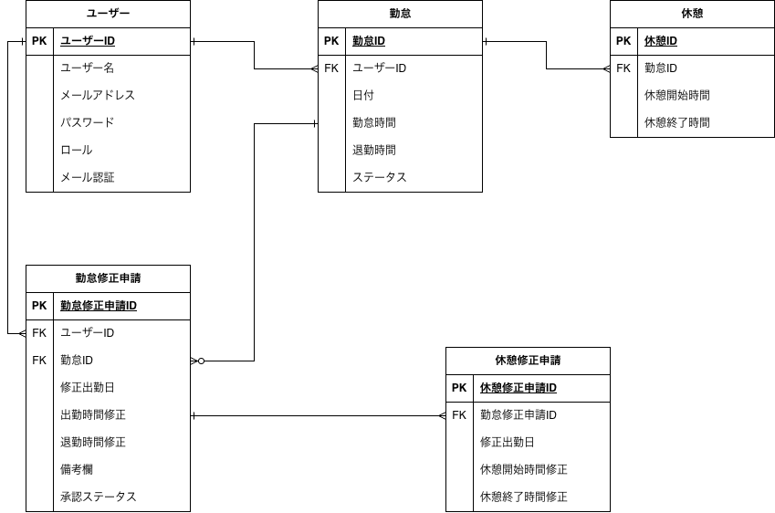

# 模擬案件_勤怠管理アプリ

勤怠の登録、管理ができるWebアプリケーションです。

## 環境構築

### Docker ビルド

1.  git clone git@github.com:hiori03/attendance-app.git
2.  docker-compose up -d --build

＊MySQL は、OS によって起動しない場合があります。それぞれの PC に合わせて docker-compose.yml ファイルを編集してください。

### Laravel 環境構築

1.  docker-compose exec php bash
2.  composer install
3.  cp .env.example .env 環境変数を変更
4.  php artisan key:generate
5.  php artisan migrate
6.  php artisan db:seed

## PHPUnitテスト

### テスト環境 (.env.testing) の設定

-  cp .env.testing.example .env.testing 環境変数を変更

### テスト用DB作成

1.  docker-compose exec mysql mysql -u root -p
2.  CREATE DATABASE laravel_test;
3.  docker-compose exec php bash
4.  php artisan migrate --env=testing

### テストの実行

-   php artisan test

## 管理者ユーザー情報

-   メールアドレス: admin@example.com
-   パスワード: password

## 一般ユーザー情報

-   メールアドレス: test@example.com
-   パスワード: password

## 使用技術(実行環境)

-   Laravel 8.83.29 (FPM)
-   Laravel Fortify
-   PHP 8.1.33
-   Nginx 1.29.3
-   MySQL 8.0.44
-   phpMyAdmin
-   Docker / Docker Compose
-   MailHog
-   JavaScript

＊担当のコーチにJavaScriptの使用許可を得ています。

## ER 図

## URL

-   開発環境：http://localhost/
-   phpMyAdmin：http://localhost:8080/
-   MailHog：http://localhost:8025/
-   案件シート：https://docs.google.com/spreadsheets/d/1dsMMBIXKntsO4CTemTRStbmYHxkCYtTn-nWaAEWCNak/edit?gid=537266580#gid=537266580